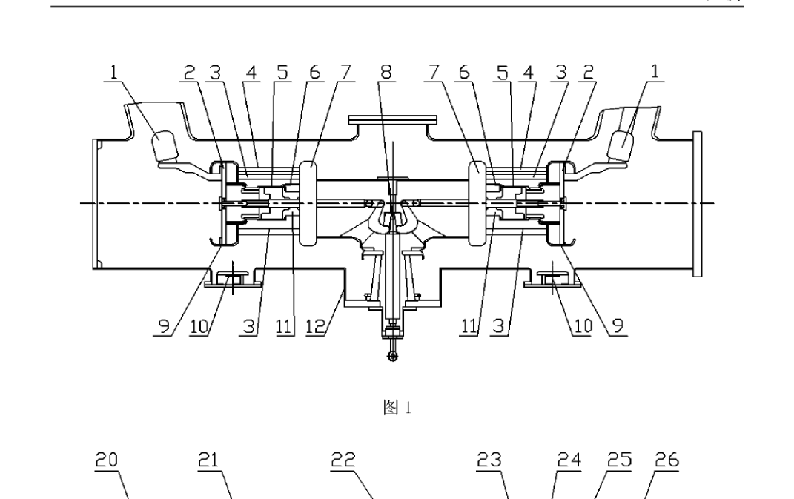
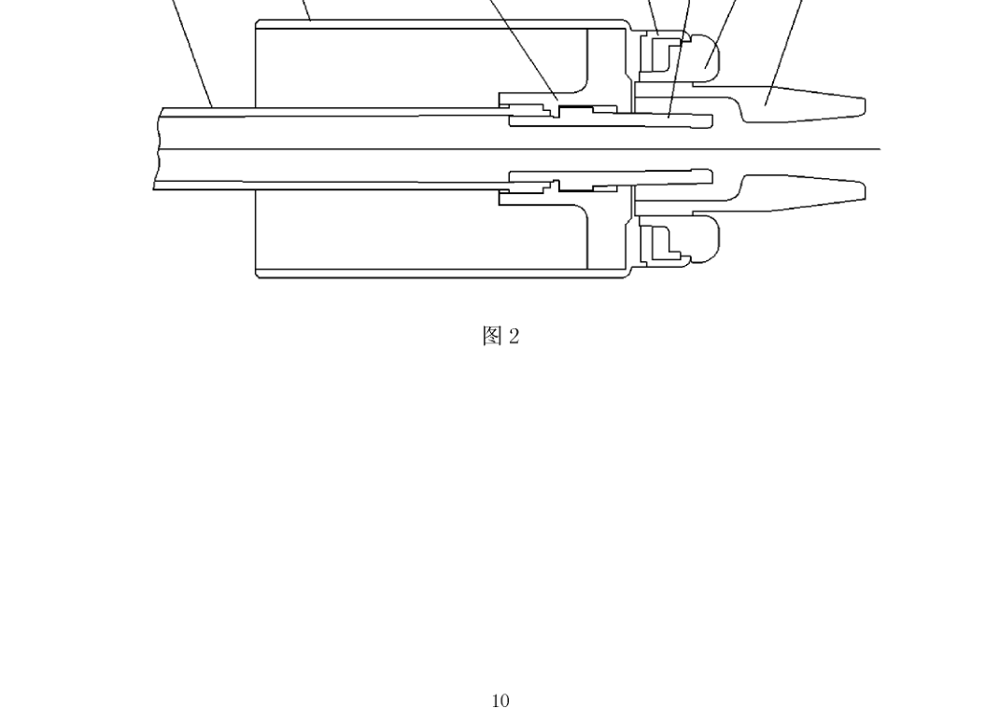
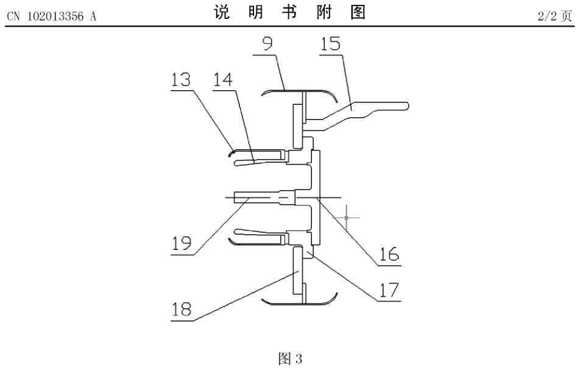
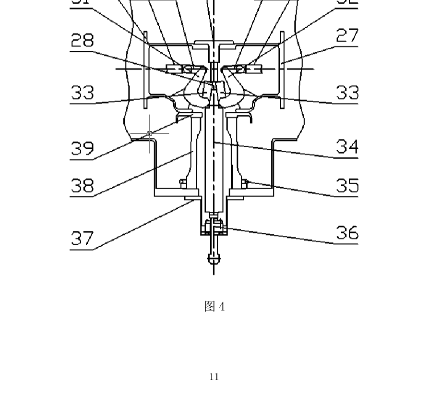

# CN102013356A 摘录整理  
## 高压交流 SF6 罐式断路器的灭弧室（图文对照）

> **来源**：中国发明专利 CN102013356A / CN102013356B  
> **申请人**：中国西电电气股份有限公司  
> **公开日**：2011-04-13（授权公告日：2012-12-19）  
> **用途**：供 GIS 断路器结构与 X 射线 DR 对照文档引用（内部学习用）  
> **原文链接**：https://patents.google.com/patent/CN102013356A/zh  

---

## 1. 基本信息

| 项目 | 内容 |
|------|------|
| 发明名称 | 高压交流 SF6 罐式断路器的灭弧室 |
| 申请号 | CN201010566262 |
| 发明人 | 张猛、张震锋、杨夙峰、阮艳丽、史俊 |
| 适用范围口径 | 文中主要针对 **363 kV 及以上**双断口罐式 SF6 断路器灭弧室结构说明 |

**摘要（摘录）**  
灭弧室系统包括：壳体、梅花触头系统、静触头系统、电容器装配单元、压气缸系统、机械传动系统、离子捕捉系统、压气活塞装配单元、中间触头装配单元、绝缘支撑棒、**动端大屏蔽**和**静端大屏蔽**。灭弧室为**双断口结构**，以机械传动系统为中心两边对称；传动系统垂直运动经拐臂、连杆转为水平运动，带动两侧压气缸系统完成分合闸。

---

## 2. 零件编号总表（识图关键）

| 编号 | 名称 | 编号 | 名称 |
|------|------|------|------|
| 1 | 梅花触头系统 | 21 | 压气缸 |
| 2 | 静触头系统 | 22 | 气缸座 |
| 3 | 绝缘支撑棒 | 23 | 动主触头 |
| 4 | 电容器装配单元 | 24 | 动弧触头 |
| 5 | 压气缸系统 | 25 | 喷口座 |
| 6 | 中间触头装配单元 | 26 | 喷口 |
| 7 | 动端大屏蔽罩 | 27 | 框架 |
| 8 | 机械传动系统 | 28 | 连接块 |
| 9 | 静端大屏蔽罩 | 29 | 第一连板 |
| 10 | 离子捕捉系统 | 30 | 导向座 |
| 11 | 压气活塞装配单元 | 31 | 第一拐臂 |
| 12 | 壳体 | 32 | 第二拐臂 |
| **13** | **屏蔽罩** | 33 | 第二连板 |
| **14** | **静主触头** | 34 | 绝缘拉杆 |
| 15 | 导电杆 | 35 | 均压屏蔽环 |
| 16 | 静弧触头座 | 36 | 直动密封系统 |
| **17** | **连接法兰** | 37 | 小壳体 |
| **18** | **法兰** | 38 | 绝缘筒 |
| **19** | **静弧触头** | 39 | 屏蔽法兰 |
| 20 | 活塞杆 |  |  |

**对照页优先关注编号**：13、14、17、18、19、9（静端屏蔽与触头）；23、24、25、26（动端触头与喷口）；7（动端大屏蔽）。

---

## 3. 附图

### 图1 灭弧室总图

**说明**：550 kV 级双断口 SF6 罐式断路器灭弧室简图（整体布置）。



若裁切不够清晰，可看原附图页：`说明书附图原页_图1图2.png`

---

### 图2 压气缸系统（动侧）

**说明**：活塞杆、压气缸、动主/动弧触头、喷口等装配关系。



**连接关系（原文）**  
- 活塞杆20 与 气缸座22：**螺纹连接**  
- 装入压气缸21 后，**动主触头23** 与 **喷口座25** 通过**螺钉**与气缸座连接，固定在压气缸上  
- **动弧触头24** 通过**螺纹**固定在活塞杆20上  
- **喷口26** 通过**螺纹**固定在喷口座25上  

---

### 图3 静触头系统（重点：屏蔽罩怎么连）

**说明**：静触头屏蔽罩、静主触头、静弧触头与法兰的装配关系——本专利对 MVP 最有用的一张。



**连接关系（原文，建议直接用于图注）**  

> 静触头系统2主要由：屏蔽罩13、静主触头14、导电杆15、静弧触头座16、连接法兰17、法兰18、静弧触头19、静端大屏蔽罩9 等组成。  
>  
> - 法兰18 与 连接法兰17：**螺钉连接**  
> - **屏蔽罩13** 与 **静主触头14**：通过**螺钉及定位止扣**与 **连接法兰17** 连接  
> - 静弧触头19：螺纹连接静弧触头座16，再**螺钉固定**到连接法兰17  
> - 导电板15 及 **静端大屏蔽罩9**：通过**螺钉**与法兰18 连接  

**装配逻辑简图**

```text
静端大屏蔽罩9 ──螺钉──► 法兰18
                              │ 螺钉
                              ▼
        屏蔽罩13 + 静主触头14 ──螺钉/止扣──► 连接法兰17
                                              ▲
                         静弧触头19 ←螺纹← 静弧触头座16 ──螺钉──┘
```

**补充结构说明（原文）**  
- 屏蔽罩13：两件焊接，旋压屏蔽与法兰焊接，替代传统铸件屏蔽  
- 静主触头14：整体结构，替代传统四瓣结构，利于对中、受力均匀  
- 静弧触头座与静主触头之间：**止扣定位 + 螺钉连接**，保证动静主触头/弧触头同时对中  
- 静端大屏蔽罩9：整体旋压，减少拼装错位棱角引起的电场集中  

---

### 图4 机械传动系统

**说明**：绝缘拉杆垂直运动 → 拐臂/连板 → 活塞杆水平运动。



**与屏蔽相关的点（原文）**  
绝缘筒38 周边有**均压屏蔽环35**及**屏蔽法兰39**，用于屏蔽绝缘筒及绝缘拉杆内嵌件，改善电场。

完整原附图页：`说明书附图原页_图3图4.png`

---

## 4. 与动静触头、屏蔽相关的原文摘录

### 4.1 压气缸 / 动触头系统（对应图2）

灭弧室压气缸系统包括：活塞杆、压气缸、气缸座、动主触头、动弧触头、喷口座和喷口。  
活塞杆与气缸座螺纹连接；装入压气缸后，动主触头与喷口座经螺钉与气缸座连接并固定在压气缸上；动弧触头螺纹固定在活塞杆上；喷口螺纹固定在喷口座上。

动触头系统主要包括：压气缸系统、中间触头、屏蔽罩、支持绝缘棒等。

### 4.2 静触头系统（对应图3，核心）

断路器灭弧室静触头系统包括：屏蔽罩、静主触头、导电杆、静弧触头座、连接法兰、法兰、静弧触头和静端大屏蔽罩。  
法兰与连接法兰螺钉连接；**屏蔽罩与静主触头通过螺钉及定位止扣与连接法兰连接**；静弧触头螺纹连接静弧触头座后再螺钉固定到连接法兰；导电板及静端大屏蔽罩螺钉连接法兰。

### 4.3 大屏蔽的作用取向（原文口径）

- 动端大屏蔽罩7、静端大屏蔽罩9：整体旋压成形，使灭弧室电场更均匀  
- 新型屏蔽罩有助于提高绝缘水平、降低电场集中风险  

### 4.4 权利要求中的对应表述（便于引用）

**权利要求4（动侧）**  
压气缸系统：活塞杆、压气缸、气缸座、动主触头、动弧触头、喷口座和喷口；连接方式同正文（螺纹/螺钉）。

**权利要求6（静侧，最关键）**  
静触头系统：屏蔽罩、静主触头、导电杆、静弧触头座、连接法兰、法兰、静弧触头和静端大屏蔽罩；  
法兰与连接法兰螺钉连接；屏蔽罩与静主触头通过螺钉及定位止扣与连接法兰连接；静弧触头螺纹接座后再螺钉固定到连接法兰；导电板及静端大屏蔽罩螺钉连接法兰。

---

## 5. 给 MVP 对照文档的可直接粘贴图注

**建议标题**：断路器静端——触头与屏蔽罩装配示意（据 CN102013356A 图3）

| 编号 | 名称 | 在 DR 识图中的意义（提示） |
|------|------|----------------------------|
| ①19 | 静弧触头 | 中心杆状轮廓，常与动弧触头对中观察 |
| ②14 | 静主触头 | 环绕弧触头的主通流接触部 |
| ③13 | 屏蔽罩（触头屏蔽） | 罩在静主触头外侧，与触头同电位固定 |
| ④17 | 连接法兰 | 屏蔽与触头共同固定的基体 |
| ⑤18/9 | 法兰 / 静端大屏蔽 | 更大范围电场屏蔽轮廓 |

**一句话结论（可放正文）**  
静端常见装配是：静主触头与触头屏蔽罩经螺钉及止口共固于连接法兰；静弧触头经触头座进入同一法兰体系；外侧再以静端大屏蔽改善电场。评片时重点看屏蔽相对触头轴线是否居中、有无明显偏移或缺损影。

---

## 6. 本文件夹文件清单

| 文件 | 说明 |
|------|------|
| `CN102013356A全文.pdf` | 专利全文 |
| `图1_灭弧室总图.png` | 从图纸页裁切 |
| `图2_压气缸系统.png` | 从图纸页裁切 |
| `图3_静触头系统.png` | 从图纸页裁切（屏蔽连接重点） |
| `图4_机械传动系统.png` | 从图纸页裁切 |
| `说明书附图原页_图1图2.png` | 说明书附图第1页原图 |
| `说明书附图原页_图3图4.png` | 说明书附图第2页原图 |
| `CN102013356A_图文摘录.md` | 本整理文档 |

---

## 7. 使用注意

1. 本专利为**双断口罐式**灭弧室结构，与具体站用 GIS 厂家结构可能有差异，引用时注明“示意图，以本站厂家结构为准”。  
2. 图片与文字来自公开专利文献，内部培训/汇报可注明出处；对外发表需自行确认版权与引用规范。  
3. 若 Word 中图片偏淡，优先插入 `说明书附图原页_*.png`，再局部放大图3。
